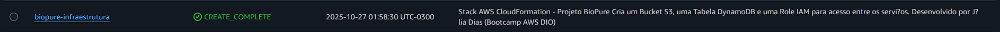
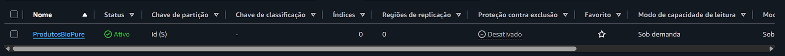

# Projeto BioPure – Infraestrutura como Código (IaC) com AWS CloudFormation

Este projeto foi desenvolvido como parte do **Bootcamp AWS CloudFormation da DIO**, com o objetivo de aplicar na prática os conceitos de **automação de infraestrutura (IaC)** utilizando o **AWS CloudFormation**.  

A stack criada automatiza a **configuração de serviços essenciais da AWS** — S3, DynamoDB e IAM — representando uma base sólida para aplicações modernas em nuvem.

---

## Sumário

1. [Objetivo do Projeto](#-objetivo-do-projeto)  
2. [Arquitetura Criada](#-arquitetura-criada)  
3. [Passo a Passo de Implementação](#️-passo-a-passo-de-implementação)  
4. [Estrutura do Projeto](#-estrutura-do-projeto)  
5. [Aprendizados](#-aprendizados)  
6. [Evidências](#-evidências)  
7. [Referências](#-referências)  

---

## Objetivo do Projeto

- Aplicar conceitos de **Infraestrutura como Código (IaC)** na AWS;  
- Criar e gerenciar **recursos automatizados** com o CloudFormation;  
- Compreender o papel do **AWS CLI, SDKs e CodeDeploy** na automação;  
- Documentar o processo técnico e publicar como **portfólio profissional**.

---

## Arquitetura Criada

A stack do projeto **BioPure Infraestrutura** foi criada para provisionar automaticamente:

| Recurso | Tipo | Função |
|----------|------|--------|
|  **S3 Bucket** | `AWS::S3::Bucket` | Armazenar dados e arquivos do projeto com versionamento habilitado |
|  **Tabela DynamoDB** | `AWS::DynamoDB::Table` | Registrar dados do sistema (ex.: produtos, sensores IoT etc.) |
|  **Role IAM** | `AWS::IAM::Role` | Permitir que serviços AWS interajam com S3 e DynamoDB com segurança |

---

## Passo a Passo de Implementação

### Criação da Stack
1. Acesse o **AWS Console** → serviço **CloudFormation**  
2. Clique em **Criar pilha → Com novos recursos (padrão)**  
3. Escolha **Upload de arquivo de modelo**  
4. Selecione o arquivo `templates/stack-template.yaml`  
5. Dê o nome da pilha: `biopure-infraestrutura`  
6. Clique em **Next → Next → Create stack (Criar pilha)**  

---

### Monitoramento da Criação
- Acompanhe o progresso na aba **Events (Eventos)**  
- Quando aparecer **CREATE_COMPLETE **, significa que a infraestrutura foi criada com sucesso  

---

### Validação dos Recursos Criados
| Serviço | Onde Verificar | Resultado Esperado |
|----------|----------------|--------------------|
| **S3** | Console → S3 | Bucket `biopure-infraestrutura-demo` criado e versionado |
| **DynamoDB** | Console → DynamoDB | Tabela `ProdutosBioPure` criada |
| **IAM** | Console → IAM → Roles | Role `BioPureInfraRole` criada com permissões em S3 e DynamoDB |

---

### Exclusão da Stack (para evitar custos)
Após verificar os recursos:
1. Volte ao **CloudFormation**
2. Selecione sua stack  
3. Clique em **Excluir pilha (Delete stack)**  
4. Aguarde até o status mostrar **DELETE_COMPLETE**

---

## Estrutura do Projeto

aws-bioinfra/
│
├── templates/
│ └── stack-template.yaml
│
├── images/
│ ├── create-complete.png
│ ├── s3-bucket.png
│ ├── dynamodb-table.png
│ └── iam-role.png
│
└── README.md

---

## Aprendizados

Durante o desenvolvimento deste projeto, aprendi sobre:

- Como o **AWS CloudFormation** gerencia recursos como código de forma automatizada;  
- A importância de versionar e documentar infraestrutura com **YAML**;  
- O papel do **IAM** na segurança de serviços e permissões;  
- Como a abordagem **IaC (Infrastructure as Code)** garante consistência e agilidade em projetos cloud.

---

## Evidências

Abaixo alguns registros do projeto executado no console da AWS:

- Stack criada com sucesso (`CREATE_COMPLETE`) 

- Bucket S3 visível no console

- Tabela DynamoDB criada automaticamente

- Role IAM configurada

---

## Referências

- [Documentação AWS CloudFormation](https://docs.aws.amazon.com/pt_br/AWSCloudFormation/latest/UserGuide/Welcome.html)  
- [AWS CLI Documentation](https://docs.aws.amazon.com/cli/latest/userguide/cli-configure-files.html)  
- [Bootcamp DIO - AWS CloudFormation](https://www.dio.me/bootcamp)  
- [Guia Markdown no GitHub](https://guides.github.com/features/mastering-markdown/)
